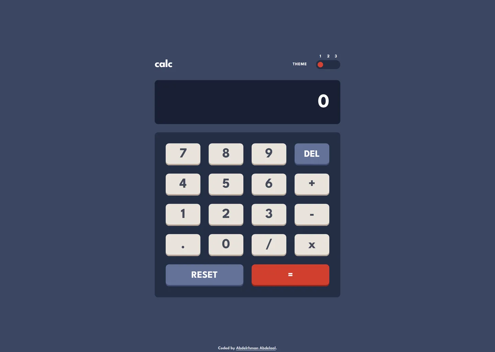

# calc

My solution to the [Calculator app](https://www.frontendmentor.io/challenges/calculator-app-9lteq5N29) challenge on Frontend Mentor.

- Live: https://calculator-app.abdelrhman-ahmed8881.workers.dev
- Code: https://github.com/MrBlackvanta/calculator-app

## Built with

- Next.js
- React
- TypeScript
- Tailwind CSS

## Author

- [LinkedIn](https://www.linkedin.com/in/abdelrhman-vanta/)
- [UpWork](https://www.upwork.com/freelancers/mrblackvanta)
- [Frontend Mentor](https://www.frontendmentor.io/profile/MrBlackvanta)
